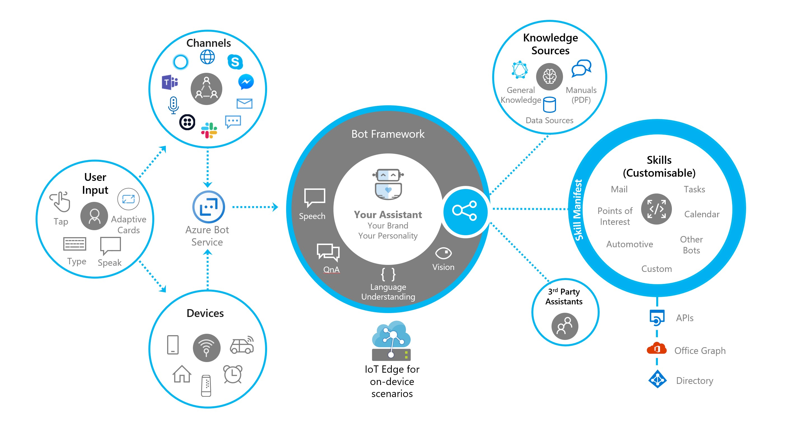

# Microsoft Bot Framework 

### [Click here to find out what's new with Bot Framework](./whats-new.md#whats-new)

The Microsoft Bot Framework is a comprehensive platform for building enterprise-grade conversational AI experiences. It includes a set of open source SDKs, tools, and services which enable developers to **build**, **test**, and **connect** bots that interact naturally with users, wherever they are. With the Microsoft Bot Framework, it is easy to create a bot with the ability to speak, listen, understand, and learn from your users with Azure Cognitive Services. 

This repo lists the SDK, tools, and services needed to build a great conversational AI experience. Its role is to serve as a landing page and one place to find all the information required to get started. 

- [Bot Framework SDK v4](#Bot-Framework-SDK-v4)
- [Bot Framework Solutions](#Bot-Framework-Solutions)
- [Azure Bot Service](#Azure-Bot-Service)
- [Bot Framework Emulator](#Bot-Framework-Emulator)
- [Bot Framework Web Chat](#Bot-Framework-Web-Chat)
- [Bot Framework Tools](#Bot-Framework-Tools)
- [Language Understanding](#Language-Understanding)
- [QnA Maker](#QnA-Maker)
- [Dispatch](#Dispatch)
- [Speech Services](#Speech-Services)  
- [Adaptive cards](#Adaptive-Cards)
- [Bot Framework SDK v3](#Bot-Framework-SDK-v3)

## Bot Framework SDK v4
The Bot Framework SDK v4 is an [open source SDK][1a] that enable developers to model and build sophisticated conversation using their favorite programming language.

|   | C#  | JS  | Python |  Java | 
|---|:---:|:---:|:------:|:-----:|
|Stable Release |[4.5.x][1] | [4.5.x][2] | [4.5.0b2 (preview)][3] | [4.0.0a6 (preview)][3a]|
|Docs | [docs][5] |[docs][5] |  | |
|Samples |[.NET Core][6], [WebAPI][10] |[Node.js][7] , [TypeScript][8], [es6][9]  | [Python][111] | | 

[1a]:https://github.com/microsoft/botframework-sdk/#readme
[1]:https://github.com/Microsoft/botbuilder-dotnet/#packages
[2]:https://github.com/Microsoft/botbuilder-js#packages
[3]:https://github.com/Microsoft/botbuilder-python#packages
[3a]:https://github.com/Microsoft/botbuilder-java#packages
[4]:https://github.com/Microsoft/botbuilder-java#packages
[5]:https://docs.microsoft.com/en-us/azure/bot-service/?view=azure-bot-service-4.0
[6]:https://github.com/Microsoft/BotBuilder-Samples/tree/master/samples/csharp_dotnetcore
[7]:https://github.com/Microsoft/BotBuilder-Samples/tree/master/samples/javascript_nodejs
[8]:https://github.com/Microsoft/BotBuilder-Samples/tree/master/samples/typescript_nodejs
[9]:https://github.com/Microsoft/BotBuilder-Samples/tree/master/samples/javascript_es6
[10]:https://github.com/Microsoft/BotBuilder-Samples/tree/master/samples/csharp_webapi
[111]:https://github.com/Microsoft/botbuilder-python/tree/master/samples

### Bot Framework SDK v4 - (New! - version 4.6 preview)
The Bot Framework SDK v4 - Version 4.6 new capabilites in preview. 

- [Adaptive Dialog][47] | [docs][48] | [C# samples][49] :: Adaptive Dialogs enable developers to build conversations that can be dynamically changed as the conversation progresses.  Traditionally developers have mapped out the entire flow of a conversation up front, which limits the flexibility of the conversation.  Adaptive dialogs allow them to be more flexible, to respond to changes in context and insert new steps or entire sub-dialogs into the conversation as it progresses. Additionally as with other SDK V4 concepts, we have defined adaptive dialogs such that they can be defined via [declarative][50] that are interpreted at runtime; which allows us to have tooling on top of this and integrate with services. 

- [Language Generation][43] | [docs][44] | [C# samples][45] :: Learning from our customers experiences and bringing together capabilities first implemented by Cortana and Cognition teams, we are introducing Language Generation; which allows the developer to extract the embedded strings from their code and resource files and manage them through a Language Generation runtime and file format.  Language Generation enable customers to define multiple variations on a phrase, execute simple expressions based on context, refer to conversational memory, and over time will enable us to bring additional capabilities all leading to a more natural conversational experience.

- [Common Expression Language][40] | [api][41] :: Both Adaptive dialogs and Language Generation rely on and use a common expression language to power bot conversations.

[40]:https://github.com/Microsoft/BotBuilder-Samples/tree/master/experimental/common-expression-language#readme
[41]:https://github.com/Microsoft/BotBuilder-Samples/blob/master/experimental/common-expression-language/api-reference.md
[43]:https://github.com/Microsoft/BotBuilder-Samples/tree/master/experimental/language-generation#readme
[44]:https://github.com/Microsoft/BotBuilder-Samples/tree/master/experimental/language-generation/docs
[45]:https://github.com/Microsoft/BotBuilder-Samples/tree/master/experimental/language-generation/csharp_dotnetcore
[46]:https://github.com/Microsoft/BotBuilder-Samples/tree/master/experimental/language-generation/javascript_nodejs/13.core-bot
[47]:https://github.com/Microsoft/BotBuilder-Samples/tree/master/experimental/adaptive-dialog#readme
[48]:https://github.com/Microsoft/BotBuilder-Samples/tree/master/experimental/adaptive-dialog/docs
[49]:https://github.com/Microsoft/BotBuilder-Samples/tree/master/experimental/adaptive-dialog/csharp_dotnetcore
[50]:https://github.com/Microsoft/BotBuilder-Samples/tree/master/experimental/adaptive-dialog/declarative

#### Botkit
[Botkit][100] is a developer tool and SDK for building chat bots, apps and custom integrations for major messaging platforms. Botkit bots `hear()` triggers, `ask()` questions and `say()` replies. Developers can use this syntax to build dialogs - now cross compatible with the latest version of Bot Framework SDK. 

In addition, Botkit brings with it 6 platform adapters allowing Javascript bot applications to communicate directly with messaging platforms: [Slack][102], [Webex Teams][103], [Google Hangouts][104], [Facebook Messenger][105], [Twilio][106], and [Web chat][107].

Botkit is part of Microsoft Bot Framework and is released under the [MIT Open Source license][101]

[100]:https://github.com/howdyai/botkit#readme
[101]:https://github.com/howdyai/botkit/blob/master/LICENSE.md
[102]:https://github.com/howdyai/botkit/tree/master/packages/botbuilder-adapter-slack#readme
[103]:https://github.com/howdyai/botkit/tree/master/packages/botbuilder-adapter-webex#readme
[104]:https://github.com/howdyai/botkit/tree/master/packages/botbuilder-adapter-hangouts#readme
[105]:https://github.com/howdyai/botkit/tree/master/packages/botbuilder-adapter-facebook#readme
[106]:https://github.com/howdyai/botkit/tree/master/packages/botbuilder-adapter-twilio-sms#readme
[107]:https://github.com/howdyai/botkit/tree/master/packages/botbuilder-adapter-web#readme

## Bot Framework Solutions (New! - preview)

The [Bot Framework Solutions repository](https://github.com/Microsoft/botframework-solutions#readme) provides a set of templates, solution accelerators and skills to help build sophisticated conversational experiences.

| Name | Description |  
|:------------:|------------| 
| | [**Virtual Assistant.**](https://aka.ms/bfvadocs) Customers and partners have a significant need to deliver a conversational assistant tailored to their brand, personalized to their users, and made available across a broad range of canvases and devices.     This brings together all of the supporting components and greatly simplifies the creation of a new bot project including: basic conversational intents, Dispatch integration, QnA Maker, Application Insights and an automated deployment.|
|)| [**Skills.**](https://aka.ms/bfskillsdocs) A library of re-usable conversational skill building-blocks enabling you to add functionality to a Bot. We currently provide: Calendar, Email, Task, Point of Interest, Automotive, Weather and News skills. Skills include LUIS models, Dialogs, and integration code delivered in source code form to customize and extend as required.|
|| [**Analytics.**](https://github.com/Microsoft/AI/blob/master/docs/readme.md#analytics) Gain key insights into your bot’s health and behavior with the Bot Framework Analytics solutions, which includes: sample Application Insights queries, and Power BI dashboards to understand the full breadth of your bot’s conversations with users.|

## Azure Bot Service
Azure Bot Service enables you to host intelligent, enterprise-grade bots with complete ownership and control of your data. Developers can register and connect their bots to users on Skype, Microsoft Teams, Cortana, Web Chat, and more. [Azure][27]  |  [docs][28] | [connect to channels][29] 

* **Direct Line JS Client**: If you want to use the Direct Line channel in Azure Bot Service and are not using the WebChat client, the Direct Line JS client can be used in your custom application. [Github][30]

* **Direct Line Speech Channel**: We are bringing together the Bot Framework and Microsoft's Speech Services to provide a channel that enables streamed speech and text bi-directionally from the client to the bot application.  To sign up, add the 'Direct Line Speech' channel to your Azure Bot Service.

[27]:https://azure.microsoft.com/en-us/services/bot-service/
[28]:https://docs.microsoft.com/en-us/azure/bot-service/bot-service-overview-introduction?view=azure-bot-service-4.0
[29]:https://docs.microsoft.com/en-us/azure/bot-service/bot-service-manage-channels?view=azure-bot-service-4.0
[30]:https://github.com/Microsoft/BotFramework-DirectLineJS/blob/master/README.md

* **Better isolation for your Bot - Direct Line App Service Extension** : The Direct Line App Service Extension can be deployed as part of a VNET, allowing IT administrators to have more control over conversation traffic and improved latency in conversations due to reduction in the number of hops. Get started with Direct Line App Service Extension here. A VNET lets you create your own private space in Azure and is crucial to your cloud network as it offers isolation, segmentation, and other key benefits. 

## Bot Framework Emulator
The [Bot Framework Emulator][60] is a  cross-platform desktop application that allows bot developers to test and debug bots built using the Bot Framework SDK. You can use the Bot Framework Emulator to test bots running locally on your machine or to connect to bots running remotely.

- [Download latest][61] | [Docs][62]

### Bot Inspector (New! - Public Available)
The Bot Framework Emulator has released a Beta of the new Bot Inspector feature: a way to debug and test your Bot Framework SDK v4 bots on channels like Microsoft Teams, Slack, Cortana, Facebook Messenger, Skype, etc. As you have the conversation, messages will be mirrored to the Bot Framework Emulator where you can inspect the message data that the bot received. Additionally, a snapshot of the bot state for any given turn between the channel and the bot is rendered as well. You can inspect this data by clicking on the "Bot State" element in the conversation mirror. Read more about [Bot Inspector](https://github.com/Microsoft/BotFramework-Emulator/blob/master/content/CHANNELS.md)

[60]:https://github.com/Microsoft/BotFramework-Emulator#readme
[61]:https://github.com/Microsoft/BotFramework-Emulator/releases/latest
[62]:https://docs.microsoft.com/en-us/azure/bot-service/bot-service-debug-emulator?view=azure-bot-service-4.0

## Bot Framework Web Chat
The Bot Framework [Web Chat][23] is a highly customizable web-based client chat control for Azure Bot Service that provides the ability for users to interact with your bot directly in a web page. Following enterprise customers asks, we put together a Web Chat sample for [single sign-on for enterprise apps using OAuth](https://github.com/microsoft/BotFramework-WebChat/tree/master/samples/19.a.single-sign-on-for-enterprise-apps#single-sign-on-demo-for-enterprise-apps-using-oauth). In this sample, we show how to authorize a user to access resources on an enterprise app with a bot. Two types of resources are used to demonstrate the interoperability of OAuth: Microsoft Graph and GitHub API.

- [Stable release][24] | [Docs][25]  | [Samples][26]

[23]:https://github.com/Microsoft/BotFramework-WebChat#readme
[24]:https://www.npmjs.com/package/botframework-webchat
[25]:https://github.com/Microsoft/BotFramework-WebChat/tree/master/doc
[26]:https://github.com/Microsoft/BotFramework-WebChat/tree/master/samples

## Bot Framework Tools
The Bot Framework SDK tools is an [open source](https://github.com/Microsoft/botbuilder-tools) collection of cross-platform command line tools designed to support building robust end-to-end development workflows.

| Tool | Description |
|------|--------------|
| [Chatdown][16] | Prototype mock conversations in markdown and convert the markdown to transcripts you can load and view in the new V4 Bot Framework Emulator |
| [LUDown][17]| Build LUIS language understanding models using markdown files|
| [LUISGen][21] | Auto generate backing C# / Typescript classes for your LUIS intents and entities.|
| [az bot][36] | Manage Azure Bot Service using Azure CLI|
|[LUIS][LUISCLI] | Create and manage your [LUIS.ai](http://luis.ai) applications |
|[QnAMaker][QNACLI] | Create and manage [QnAMaker.ai](http://qnamaker.ai) Knowledge Bases. |
| [Dispatch][DispatchCLI] | Build language models allowing you to dispatch between disparate components (such as QnA, LUIS and custom code)|
| [MSBot][22]| Create and manage connected services in your bot configuration file|

[16]:https://github.com/Microsoft/botbuilder-tools/blob/master/packages/Chatdown#readme
[17]:https://github.com/Microsoft/botbuilder-tools/blob/master/packages/Ludown#readme
[21]:https://github.com/Microsoft/botbuilder-tools/blob/master/packages/LUISGen#readme
[22]:https://github.com/Microsoft/botbuilder-tools/blob/master/packages/MSBot#readme
[36]:https://docs.microsoft.com/en-us/cli/azure/bot?view=azure-cli-latest
[LUISCLI]:https://github.com/Microsoft/botbuilder-tools/blob/master/packages/LUIS#readme
[QNACLI]:https://github.com/Microsoft/botbuilder-tools/blob/master/packages/QnAMaker#readme
[DispatchCLI]:https://github.com/Microsoft/botbuilder-tools/tree/master/packages/Dispatch#readme

## Related Services

### Language Understanding 
A machine learning-based service to build natural language experiences. Quickly create enterprise-ready, custom models that continuously improve. [Language Understanding Service(LUIS)][30] allows your application to understand what a person wants in their own words.

- **Roles, External Entities and Dynamic Entities** :: LUIS has added several features that let developers extract more detailed information from text, so users can now build more intelligent solutions with less effort. LUIS also extended roles to all entity types, which allows the same entities to be classified with different subtypes based on context. Developers now have more granular control of what they can do with LUIS, including being able to identify and update models at runtime through dynamic lists and external entities. Dynamic lists are used to append to list entities at prediction time, permitting user-specific information to get matched exactly. Separate supplementary entity extractors are run with external entities, and that information can be appended to LUIS as strong signals for other models.

- **Analytics dashboard** :: LUIS is releasing a more detailed, visually-rich comprehensive analytics dashboard. Its user-friendly design highlights common issues most users face when designing applications, by providing simple explanations on how to resolve them to help users gain more insight into their models’ quality, potential data problems, and guidance to adopt best practices.

[Docs][31] | [Add language understanding to your bot][32] | use [LUDown][17] and [LUIS][18] command line tools 

[18]:https://github.com/Microsoft/botbuilder-tools/tree/master/packages/LUIS#readme
[19]:https://github.com/Microsoft/botbuilder-tools/tree/master/packages/QnAMaker#readme
[30]:https://www.luis.ai
[31]:https://docs.microsoft.com/en-us/azure/cognitive-services/LUIS/Home
[32]:https://docs.microsoft.com/en-us/azure/bot-service/bot-builder-howto-v4-luis?view=azure-bot-service-4.0&branch=pr-en-us-1325&tabs=csharp

### QnA Maker
[QnA Maker][33] is a cloud-based API service that creates a conversational, question-and-answer layer over your data. With QnA Maker, you can build, train and publish a simple question and answer bot based on FAQ URLs, structured documents, product manuals or editorial content in minutes.

- **Extraction pipeline**: Now you can extract hierarchical information from URLs, files and sharepoint
- **Intelligence**: Contextual ranking models, active learning suggestions
- **Conversation**: Multi-turn conversations in QnA Maker.

[Docs][34]  | [add qnamaker to your bot][35] | use [LUDdown][17] and [QnAMaker][19] command line tools

[33]:https://www.qnamaker.ai/
[34]:https://aka.ms/qnamaker-docs-home
[35]:https://docs.microsoft.com/en-us/azure/bot-service/bot-builder-howto-qna?view=azure-bot-service-4.0&branch=pr-en-us-1325&tabs=cs

### Dispatch
[Dispatch][20] lets you build language models that allow you to dispatch between disparate components (such as QnA, LUIS and custom code).

[20]:https://github.com/Microsoft/botbuilder-tools/blob/master/packages/Dispatch#readme

### Speech Services
[Speech Services][70] convert audio to text, perform speech translation and text-to-speech with the unified Speech services. With the speech services, you can integrate speech into your bot, create custom wake words, and author in multiple languages.

[70]:https://azure.microsoft.com/en-us/services/cognitive-services/speech-services/

### Adaptive Cards
[Adaptive Cards](https://adaptivecards.io) are an open standard for developers to exchange card content in a common and consistent way, 
and are used by Bot Framework developers to create great cross-channel conversatational experiences.

* **Open framework, native performance** - A simple open card format enables an ecosystem of shared tooling, seamless integration between apps, and native cross-platform performance on any device.
* **Speech enabled from day one** - We live in an exciting era where users can talk to their devices. Adaptive Cards embrace this new world and were designed from the ground up to support these new experiences.

## Bot Framework SDK v3

> Note: While we actively maintain the v3 SDK, we are focusing out attention on the v4 of the SDK. Read more on [SDK v3 long-term support](https://docs.microsoft.com/en-us/azure/bot-service/bot-service-resources-bot-framework-faq?view=azure-bot-service-3.0#bot-framework-sdk-version-3-lifetime-support).

The Bot Framework SDK v3 includes SDKs that enable developers to model and build sophisticated conversation using their favorite programing language.

|  | C# | JS |  
|---|:---:|:---:|
|Stable Release |[3.20.1][11] | [3.16.0][12] | 
|Docs | [docs][13] |[docs][13] | 
|Samples |[C#][14] |[Node.js][15] |

[11]:https://www.nuget.org/packages/Microsoft.Bot.Builder/3.20.1
[12]:https://www.npmjs.com/package/botbuilder/v/3.16.0
[13]:https://docs.microsoft.com/en-us/azure/bot-service/?view=azure-bot-service-3.0
[14]:https://github.com/Microsoft/BotBuilder-V3/tree/master/CSharp/Samples
[15]:https://github.com/Microsoft/BotBuilder-V3/tree/master/Node/examples

## Reporting Security Issues

Security issues and bugs should be reported privately, via email, to the Microsoft Security Response Center (MSRC) at [secure@microsoft.com](mailto:secure@microsoft.com). You should receive a response within 24 hours. If for some reason you do not, please follow up via email to ensure we received your original message. Further information, including the [MSRC PGP](https://technet.microsoft.com/en-us/security/dn606155) key, can be found in the [Security TechCenter](https://technet.microsoft.com/en-us/security/default).

Copyright (c) Microsoft Corporation. All rights reserved.
